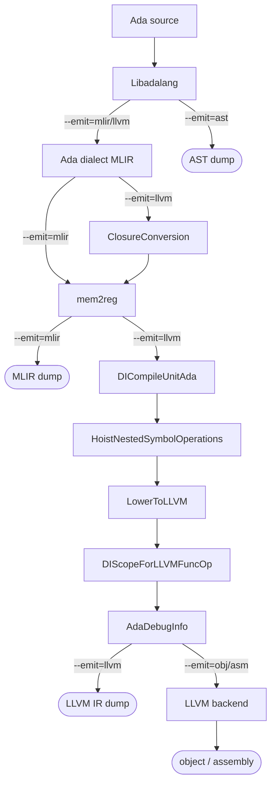

# LALVM: Ada to LLVM Compiler

LALVM is a prototype Ada-to-LLVM compiler using MLIR as an intermediate representation.

## Pipeline

The front end (Libadalang + MLIRGen) is shared; the `--emit` flag selects how far
the pipeline runs and what it prints.



- `--emit=ast` stops after Libadalang and dumps the AST.
- `--emit=mlir` runs MLIRGen (and `mem2reg` at `-O1`) and dumps the Ada dialect.
- `--emit=llvm` runs the full lowering chain above, then translates to LLVM IR.
- `--emit=obj` / `--emit=asm` run the LLVM backend on that IR to write an object
  file or target assembly for the host target.

`mem2reg` runs only at `-O1`; the default `-O0` leaves locals in memory. The
debug-info passes (`DICompileUnitAda`, `DIScopeForLLVMFuncOp`, `AdaDebugInfo`)
run only under `-g`. The diagram above shows the full `-O1 -g` pipeline.

## Building

Copy the example user presets file and fill in the paths for your environment:

```sh
cp CMakeUserPresets.json.example CMakeUserPresets.json
# edit CMakeUserPresets.json: set LIBADALANG_INCLUDE_DIR, MLIR_DIR, compilers, lit
```

Then configure and build:

```sh
cmake --preset=debug
cmake --build --preset=debug
```

`CMakeUserPresets.json` is gitignored; each developer maintains their own copy.
`CMakePresets.json` is committed and holds the shared build settings (Ninja, Debug
mode, assertions enabled).

## Usage

```
lalvm [--emit=<action>] [-P <project.gpr>] [-o <file>] <input-file>
```

Options:
- `--emit {ast,mlir,llvm,obj,asm}`: output format (default: `obj`)
- `--x {Ada,mlir}`: input type (default: Ada; inferred from `.mlir` extension)
- `-o <file>`: output file (default: stdout for text dumps; the input basename
  with a `.o`/`.s` extension for `obj`/`asm`)
- `-P <project.gpr>` (alias `--project`): load a GPR project so `with`ed units
  resolve through its unit provider (otherwise the single file is parsed alone)
- `-O {0,1}`: optimization level (default `0`; `1` runs `mem2reg`)
- `-g`: generate DWARF debug info (off by default)
- `--record-command-line`: record the invocation in `llvm.commandline` (off by
  default; it embeds input/output paths)
- standard LLVM codegen flags (`-mcpu`, `-mattr`, `--relocation-model`, ...)
  apply to `--emit=obj`/`asm`

## Example

```ada
-- compute.adb
function Compute (X : Integer) return Integer is
   function Double (N : Integer) return Integer is
   begin
      return N + N;
   end Double;
   Result : Integer := Double (X);
begin
   return Result;
end Compute;
```

```sh
lalvm --emit=ast  compute.adb      # Libadalang AST dump
lalvm --emit=mlir compute.adb      # Ada MLIR dialect (-O0: locals in memory)
lalvm --emit=mlir -O1 compute.adb  # Ada MLIR dialect (mem2reg promotes locals)
lalvm --emit=llvm compute.adb      # LLVM IR
```

MLIR output:
```mlir
module @compute {
  ada.type @standard.integer : i32 = #ada.int_info<range -2147483648 to 2147483647>
  ada.subp @compute(%arg0: !ada.qual<i32, @standard.integer>) -> !ada.qual<i32, @standard.integer> {
    %0 = ada.call @compute.double(%arg0) : (!ada.qual<i32, @standard.integer>) -> !ada.qual<i32, @standard.integer>
    ada.decls {
      ada.subp private @compute.double(%arg1: !ada.qual<i32, @standard.integer>) -> !ada.qual<i32, @standard.integer> {
        %1 = ada.binop "+" %arg1, %arg1 checks<overflow> : !ada.qual<i32, @standard.integer>
        ada.return %1 : !ada.qual<i32, @standard.integer>
      }
    }
    ada.return %0 : !ada.qual<i32, @standard.integer>
  }
}
```

Nested subprograms are kept in an `ada.decls` symbol container under their
enclosing subprogram and carry a qualified `private` name; closure conversion
and hoisting flatten them to module level on the `--emit=llvm` path. The output
above is from `-O1`, where `mem2reg` has promoted the `Result` local so the call
result flows straight into the `return`; at the default `-O0` it stays in memory
as an `ada.alloca` with a store and load.

## Generating machine code

lalvm can run the LLVM backend itself to emit target assembly or an object file
for the host target:

```sh
lalvm --emit=asm compute.adb         # -> compute.s
lalvm --emit=obj compute.adb         # -> compute.o
lalvm --emit=asm compute.adb -o -    # assembly to stdout
```

Without `-o`, `obj`/`asm` output goes to the input basename with a `.o`/`.s`
extension. CPU and codegen tuning use the standard LLVM flags (`-mcpu`,
`-mattr`, `--relocation-model`, ...).

To target a non-host architecture, pipe the LLVM IR to `llc` (lalvm itself only
emits for the host):

```sh
lalvm --emit=llvm add.adb | llc -mtriple=aarch64-linux-gnu -o add.s
```

## Symbol naming (ABI)

LALVM follows GNAT's symbol naming convention:

- **Library-level subprograms** get the `_ada_` prefix:
  `procedure Foo` -> `_ada_foo`
- **Nested subprograms** get a `parent__child` mangled name without the prefix:
  `procedure Inner` inside `procedure Outer` -> `outer__inner`
- **Operator subprograms** are mapped to GNAT O-names before mangling:
  `function "*"` nested inside `procedure Outer` -> `outer__Omultiply`

This allows lalvm-compiled code to be linked against GNAT-compiled code and
called from C using the same name mangling convention.

## Debug info

Debug info is emitted only under `-g`; without it no `.debug_*` sections are
produced (source locations still ride on every op for diagnostics and exception
messages). With `-g`, LALVM emits DWARF 5 with `DW_LANG_Ada2012`, carried from
the MLIR op locations through to LLVM IR.

Each named Ada object (variable, constant, named number, parameter) carries a
`NameLoc` in the Ada dialect, which `AdaDebugInfoPass` consumes to emit
`dbg.declare` (for stack variables) or `dbg.value` (for constants and named
numbers). Enum types produce `DICompositeType` entries with one `DIEnumerator`
per literal. Constrained integer subtypes produce `DISubrangeType` entries with
their bounds: constants for static bounds, and a referenced `DILocalVariable`
for a dynamic bound (currently a subprogram parameter; see the limitations in
`AdaDebugInfoPass`). Ada `goto` labels get a `DW_TAG_label` (via
`llvm.intr.dbg.label`), so a debugger can break on a labeled statement.

To inspect source locations in the MLIR output:

```sh
lalvm --emit=mlir --mlir-print-debuginfo --mlir-print-local-scope add.adb
```

This prints each op's source location inline, for example:

```mlir
%0 = ada.binop "+" %arg0, %arg1 : !ada.qual<i32, @standard.integer> loc("add.adb":15:13 to :14)
```

## Status

Work in progress. Only a subset of Ada is supported; most language features
are not yet implemented.

**Expressions:**
- Integer and real literals; named numbers
- Binary arithmetic: `+`, `-`, `*`, `/`
- Relational comparisons: `=`, `/=`
- If expressions and parenthesized expressions
- Variable and parameter references
- Function calls (including nested)
- Enum and character literals
- `'First`/`'Last` attributes on scalar (sub)types

**Checks:**
- Overflow check on signed-integer `+`/`-`/`*` and a division check on integer
  `/`, raising `Constraint_Error` (modular arithmetic wraps, no check)
- `Constraint_Error` range checks where a value flows into a constrained
  subtype; statically-resolved checks are decided at compile time (out-of-range
  static expressions are diagnosed, in-range ones emit no check)

**Statements:**
- Assignments, `return`, `null`
- Procedure calls
- `if` statements
- Loop statements: `while` and bare `loop`, with `exit` (named or plain)
- `goto` statements and labels
- Block statements (`begin`/`end` and `declare`/`begin`/`end`)

**Declarations:**
- Subprograms: functions and procedures, library-level and nested, including
  up-level references (a nested subprogram reading or writing an enclosing
  subprogram's variables)
- Local variables with and without initializers (multiple names per declaration)
- Named numbers (`N : constant := 42`)
- Type declarations: integer, float, modular integer, enum (including `Boolean`)
- User-defined operator functions (definitions and calls; mangled to GNAT O-names)

**Parameters:** `in` (by value), `in out` and `out` (by reference)

**Types:**
- `Integer` (i32), `Short_Integer` (i16), `Long_Integer` (i64)
- `Float` (f32), `Long_Float` (f64)
- `Boolean` (i1) and user-defined enum types (i1 for 2 literals, i8 for 3-256)
- `Character` (i8) and user-defined character types
- Integer subtypes with static or dynamic range constraints
  (`subtype S is Integer range 1 .. N`); widths derived from the declared range

**Debug info** (under `-g`): DWARF 5, `DW_LANG_Ada2012`, source locations on all
ops, `dbg.declare`/`dbg.value` for variables and constants, `DICompositeType`
for enum types, `DISubrangeType` for constrained integer subtypes, `DW_TAG_label`
for `goto` labels

## Architecture

The compiler is organized into the Ada dialect plus a sequence of MLIR passes:

- **Ada dialect** (`include/ada/`, `mlir/Dialect.cpp`): custom MLIR dialect.
  Operations: `ada.type`, `ada.alloca`, `ada.constant`, `ada.coerce`,
  `ada.binop`, `ada.cmp`, `ada.range`, `ada.range_check`, `ada.attr`,
  `ada.unwrap`, `ada.null`, `ada.decls`, `ada.call`, `ada.subp`, `ada.return`.
  `ada.binop` carries an optional `checks<overflow|division>` group; subtype
  constraints are a first-class `!ada.range<T, @sym>` value (static or dynamic
  bounds) checked by `ada.range_check`, and `ada.attr` reads `'First`/`'Last`
  from it.
  The `!ada.qual<T, @sym>` type makes Ada type identity part of the MLIR
  type system: every SSA value's type encodes both its machine representation
  `T` and its Ada declared type `@sym` (a flat symbol reference to the
  relevant `ada.type` op). Named objects (parameters, variables) additionally
  carry a `NameLoc`.
- **MLIRGen** (`mlir/MLIRGen.cpp`): lowers a Libadalang AST to the Ada
  dialect. Emits bare Ada names with no ABI mangling; nested subprograms and
  local types are placed in an `ada.decls` symbol container, and block
  statements dissolve into the enclosing subprogram.
- **ClosureConversion** (`mlir/ClosureConversion.cpp`): lambda-lifts up-level
  references (a nested subprogram reading or writing an enclosing variable)
  into explicit parameters, then hoists the now self-contained nested
  subprograms to module level. Runs before `mem2reg`.
- **HoistNestedSymbolOperations** (`mlir/HoistNestedSymbolOperations.cpp`):
  applies GNAT ABI name mangling to every subprogram (`_ada_` prefix for
  library-level ones, `parent__child` for nested ones, GNAT O-names for
  operators) and lifts the remaining `ada.type` ops to module level, leaving
  the emptied `ada.decls` containers to erase.
- **LowerToLLVM** (`mlir/LowerToLLVM.cpp`): lowers the (now flat) Ada dialect
  to the LLVM dialect, giving nested (private) subprograms internal linkage.
- **AdaDebugInfoPass** (`mlir/AdaDebugInfo.cpp`): post-lowering pass that
  emits `dbg.declare`/`dbg.value` intrinsics from `NameLoc` annotations on
  LLVM ops.

Ada parsing is handled by [Libadalang](https://github.com/AdaCore/libadalang)
through its C API (`include/frontend/AST.h`, `frontend/AST.cpp`).

## Testing

Tests use [lit](https://llvm.org/docs/CommandGuide/lit.html) and FileCheck. Each test
file in `test/` carries its own `RUN` and `CHECK` directives.

```sh
pip install lit   # one-time
cmake --build --preset=debug --target check-lalvm
```

## Documentation

API documentation is generated with Doxygen (requires doxygen and graphviz):

```sh
cmake --build --preset=debug --target doxygen
```

The output is written to `build/docs/html/`.

## Formatting

Source files are formatted with clang-format using the LLVM style. To reformat all
C++ sources in place:

```sh
cmake --build --preset=debug --target format
```

## Dependencies

- LLVM/MLIR 21 (for example on Debian: llvm-dev, libmlir-21-dev, mlir-21-tools, cmake, ninja-build, clang, clang-format)
- Libadalang
- lit (for running tests)
- doxygen and graphviz (optional, for API documentation with call graphs)
