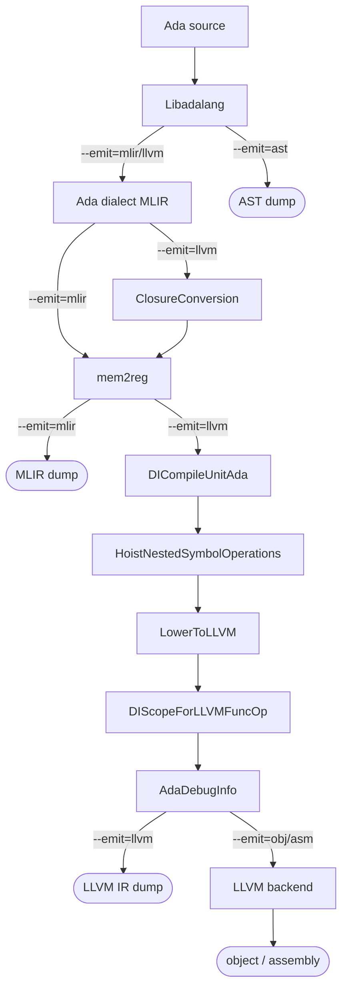

# Architecture and pipeline

## Pipeline

The frontend (Libadalang + MLIRGen) is shared. The `--emit` flag selects how far
the pipeline runs and what it prints.

- `--emit=ast` stops after Libadalang and dumps the AST.
- `--emit=mlir` runs MLIRGen (and `mem2reg` at `-O1`) and dumps the Ada dialect.
- `--emit=llvm` runs the full lowering chain above, then translates to LLVM IR.
- `--emit=obj` / `--emit=asm` run the LLVM backend on that IR to write an object
  file or target assembly for the host target.

`mem2reg` runs only at `-O1`; the default `-O0` leaves locals in memory. The
debug-info passes (`DICompileUnitAda`, `DIScopeForLLVMFuncOp`, `AdaDebugInfo`)
run only under `-g`. The diagram above shows the full `-O1 -g` pipeline.

## Architecture

The compiler is the Ada dialect (`include/ada/`, `mlir/Dialect.cpp`) lowered to
LLVM by a sequence of MLIR passes. The dialect's operations:

| Op                | Purpose                                                                                                                                           |
|-------------------|---------------------------------------------------------------------------------------------------------------------------------------------------|
| `ada.type`        | Declares a type or subtype: machine type plus a kind-specific metadata attribute (`int_info`/`enum_info`/`float_info`) and an optional base link. |
| `ada.alloca`      | Stack slot for a local object (a `memref` of an `!ada.qual`).                                                                                     |
| `ada.constant`    | A typed scalar constant.                                                                                                                          |
| `ada.coerce`      | Representation conversion between related subtypes (widen, narrow, or to base).                                                                   |
| `ada.binop`       | Predefined binary arithmetic (`+`, `-`, `*`, `/`), with an optional `checks<overflow\|division>` group.                                           |
| `ada.cmp`         | Relational comparison (`=`, `/=`, `<`, ...); Boolean result.                                                                                      |
| `ada.range`       | A subtype's constraint as a first-class `(low, high)` descriptor value (static or dynamic bounds).                                                |
| `ada.range_check` | `Constraint_Error` range check of a value against an `ada.range`.                                                                                 |
| `ada.attr`        | Scalar attribute (`'First`/`'Last`) read from a range descriptor.                                                                                 |
| `ada.unwrap`      | Exposes the machine value under an `!ada.qual`, dropping the Ada identity.                                                                        |
| `ada.null`        | The null statement.                                                                                                                               |
| `ada.decls`       | Symbol container for nested subprograms and local types.                                                                                          |
| `ada.call`        | Subprogram call (procedure or function).                                                                                                          |
| `ada.subp`        | Subprogram definition (function or procedure).                                                                                                    |
| `ada.return`      | Return from a subprogram.                                                                                                                         |

The `!ada.qual<T, @sym>` type makes Ada type identity part of the MLIR type
system: every SSA value's type encodes both its machine representation `T` and
its Ada declared type `@sym` (a flat symbol reference to the relevant `ada.type`
op). Named objects (parameters, variables) additionally carry a `NameLoc`.

The generator and passes, in pipeline order:

- **MLIRGen** (`mlir/MLIRGen.cpp`): lowers a Libadalang AST to the Ada dialect.
  Emits bare Ada names with no ABI mangling; nested subprograms and local types
  are placed in an `ada.decls` symbol container, and block statements dissolve
  into the enclosing subprogram.
- **ClosureConversion** (`mlir/ClosureConversion.cpp`): lambda-lifts up-level
  references (a nested subprogram reading or writing an enclosing variable) into
  explicit parameters, then hoists the now self-contained nested subprograms to
  module level. Runs before `mem2reg`.
- **HoistNestedSymbolOperations** (`mlir/HoistNestedSymbolOperations.cpp`):
  applies GNAT ABI name mangling to every subprogram (`_ada_` prefix for
  library-level ones, `parent__child` for nested ones, GNAT O-names for
  operators) and lifts the remaining `ada.type` ops to module level, leaving the
  emptied `ada.decls` containers to erase.
- **LowerToLLVM** (`mlir/LowerToLLVM.cpp`): lowers the (now flat) Ada dialect to
  the LLVM dialect, giving nested (private) subprograms internal linkage.
- **AdaDebugInfoPass** (`mlir/AdaDebugInfo.cpp`): post-lowering pass that emits
  `dbg.declare`/`dbg.value` intrinsics from `NameLoc` annotations on LLVM ops.

Ada parsing is handled by [Libadalang](https://github.com/AdaCore/libadalang)
through its C API (`include/frontend/AST.h`, `frontend/AST.cpp`).
